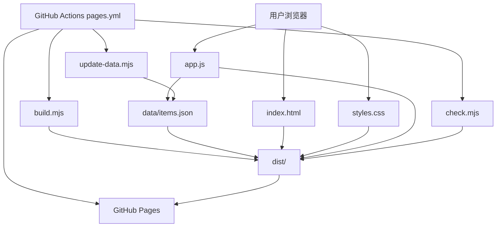
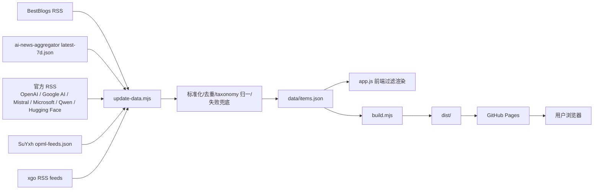
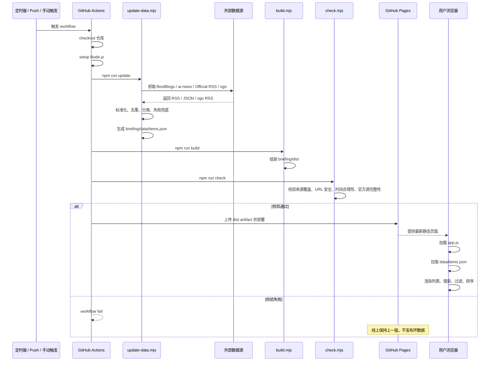

# Rose Briefing 技术说明

这份文档说明 `rose-briefing` 当前的技术路线，重点覆盖两部分：

1. **系统架构图版**（模块图 + 数据流图）
2. **从一次更新开始到上线结束的时序版**（一步一步时序说明）

---

## 1. 系统定位

`rose-briefing` 是一个 **GitHub Pages 静态 AI 资讯站**。

它不是传统的后端服务，而是：

- 在 **GitHub Actions** 里定时抓取外部数据
- 用本地 Node 脚本清洗、去重、分类、校验
- 生成一个静态目录 `briefing/dist`
- 再由 **GitHub Pages** 托管上线

所以它的核心模式是：

> **外部源抓取 → 统一 JSON → 静态前端读取 JSON → GitHub Pages 发布**

---

## 2. 目录与职责

### 仓库关键路径

- `.github/workflows/pages.yml`
  - GitHub Actions 更新与部署流程
- `briefing/index.html`
  - 页面骨架
- `briefing/styles.css`
  - 页面样式
- `briefing/app.js`
  - 前端渲染、搜索、过滤、排序
- `briefing/scripts/update-data.mjs`
  - 抓取外部源并生成统一数据
- `briefing/scripts/build.mjs`
  - 组装 `dist/` 静态发布目录
- `briefing/scripts/check.mjs`
  - 发布前静态校验
- `briefing/data/items.json`
  - 当前聚合结果
- `briefing/dist/`
  - 最终用于 GitHub Pages 发布的目录

---

## 3. 系统架构图版

### 3.1 模块图



### 3.2 模块职责说明

#### 前端模块

- `index.html`
  - 页面结构
  - 搜索框、来源 chips、平台筛选、排序入口
  - 资讯列表容器

- `styles.css`
  - 当前采用 **Editorial Light** 风格
  - 负责刊物式 masthead、列表排版、来源色点、chips、sticky filter bar

- `app.js`
  - 拉取 `data/items.json`
  - 在浏览器中做搜索/过滤/排序
  - 把时间统一显示成北京时间
  - 限制首屏最大渲染 800 条，避免 DOM 过重

#### 数据处理模块

- `update-data.mjs`
  - 抓取外部 RSS / JSON / xgo feed
  - 标准化成统一 canonical item 结构
  - 去重
  - 归一到 `family/channel/site/publisher/topic/language/originType` taxonomy
  - 失败兜底（复用上一版数据并迁移到新 schema）
  - 输出 `briefing/data/items.json`

- `build.mjs`
  - 清空并重建 `briefing/dist/`
  - 复制：
    - `index.html`
    - `styles.css`
    - `app.js`
    - `favicon.svg`
    - `data/`

- `check.mjs`
  - 发布前验证数据结构、安全性和覆盖率
  - 防止发布半残数据或脏数据

#### 部署模块

- `.github/workflows/pages.yml`
  - 定时/手动/push 触发
  - 执行 `update -> build -> check`
  - 上传 `briefing/dist` 为 Pages artifact
  - 部署到 GitHub Pages

---

## 4. 数据流图版



### 4.1 输入数据源

当前主要数据源：

1. **BestBlogs RSS**
   - 高质量筛选内容
2. **SuYxh / ai-news-aggregator `latest-7d.json`**
   - 提供大规模广覆盖资讯主体
3. **Official RSS**
   - 官方博客/新闻源（含 Hugging Face Blog）
4. **SuYxh OPML 里的 xgo feeds**
   - 一部分归 `official / x`
   - 一部分归 `community / x`

### 4.2 中间处理

`update-data.mjs` 会把所有外部源统一成同一个 canonical item 结构：

- `id`
- `title`
- `url`
- `publishedAt`
- `summary`
- `score`
- `family`（`curated | official | community | aggregator`）
- `channel`（仅 `blogs` / `x` / `aggregator`）
- `site`（始终存在、对人可读，例如 `BestBlogs` / `Hugging Face Blog` / `X/Twitter` / `TechURLs`）
- `publisher`
- `topic`
- `language`
- `originType`

### 4.3 输出

最终产物是：

- `briefing/data/items.json`

它是唯一的“发布数据入口”。

---

## 5. 从一次更新开始到上线结束的时序版

### 5.1 时序图



---

## 6. 一次更新的逐步说明

### 第 1 步：触发更新

触发来源有三种：

1. `push` 到 `main`
2. GitHub Actions 手动触发（`workflow_dispatch`）
3. 定时触发（cron）

当前 cron：

```yaml
schedule:
  - cron: "15 * * * *"
```

即：

- **每小时自动运行一次**（固定在每小时 `:15`，避开整点高拥堵时段）

---

### 第 2 步：GitHub Actions 启动构建机

工作流在：

- `.github/workflows/pages.yml`

它会：

1. `checkout` 代码
2. 安装 Node 环境
3. 进入 `briefing/`
4. 执行：

```bash
npm run update
npm run build
npm run check
```

---

### 第 3 步：抓取外部数据

`npm run update` 实际执行：

```bash
node scripts/update-data.mjs
```

这个脚本会并行抓取：

- BestBlogs RSS
- ai-news-aggregator `latest-7d.json`
- Official RSS feeds
- xgo feeds

这里的关键点：

- X feed 并发有限制（避免过多并发）
- 单个 feed 条数有限制（避免文件无限膨胀）
- 响应体有大小限制（避免异常超大返回）

---

### 第 4 步：标准化与去重

抓回来之后，脚本会：

1. 解析 RSS / JSON
2. 把不同来源统一成一个 canonical item 结构
3. 按 URL / 标题 key 去重
4. 统一时间字段
5. 给条目标注 taxonomy 字段

当前主 taxonomy 是：

- `family`：`curated | aggregator | community | official`
- `channel`：`blogs | x | aggregator`
- `site`：保留可见站点概念；BestBlogs 条目统一写 `site=BestBlogs`，官方博客保留各 feed/站点名，X 条目统一写 `site=X/Twitter`
- `publisher`：作者 / 账号 / 组织 / 出版物

---

### 第 5 步：失败兜底

如果某些来源临时失败，脚本不会马上发布一版半残数据。

它会先读取旧的：

- `briefing/data/items.json`

然后对失败来源做兜底：

- 如果新抓结果不足最低阈值
- 就尝试复用上一版同 `family` 的数据

特别是 `official` 还会细分检查：

- `blogs`
- `x`

避免出现：

- 只剩官方 blogs，没有官方 X 源
- 或只剩官方 X 源，没有官方 blogs

---

### 第 6 步：写出新数据文件

如果数据通过前面的聚合逻辑，就写：

- `briefing/data/items.json`

这个文件里有：

- `generatedAt`
- `itemCount`
- `maxItems`
- `sources`
- `warnings`
- `items`

---

### 第 7 步：构建静态站目录

`npm run build` 实际执行：

```bash
node scripts/build.mjs
```

它会：

1. 删除旧的 `briefing/dist`
2. 重新创建 `briefing/dist`
3. 复制静态文件进去：
   - `index.html`
   - `styles.css`
   - `app.js`
   - `favicon.svg`
4. 把 `briefing/data/` 整个复制到 `dist/data/`

这样 `dist/` 就变成一份完整可托管的静态网站。

---

### 第 8 步：发布前校验

`npm run check` 实际执行：

```bash
node scripts/check.mjs
```

它主要检查：

#### 数据完整性

- `items.json` 存在
- `items` 是数组
- 条数不是 0
- 总量至少达到合理阈值

#### taxonomy 覆盖

- 必须有：
  - `curated`
  - `aggregator`
  - `community`
  - `official`

#### 官方源完整性

- `official` 总条数达标
- `official + blogs` 条数达标
- `official + blogs` 站点数量达标
- `official + x` 条数达标
- `Hugging Face Blog` 不能从 source 清单或官方 blog 站点集合里静默消失

#### family/channel 配对

- `curated` 只能配 `blogs`
- `aggregator` 只能配 `aggregator`
- `community` 只能配 `x`
- `official` 只能配 `blogs` / `x`

#### 安全性

- URL 必须是 `http/https`
- `official + x` 的链接必须匹配它自己的官方 handle

#### 时间合理性

- 条目发布时间不能离生成时间异常靠后

如果校验失败：

> GitHub Actions 会直接 fail，线上不会更新。

---

### 第 9 步：GitHub Pages 部署

如果 `update/build/check` 全部通过：

1. `actions/upload-pages-artifact` 上传 `briefing/dist`
2. `actions/deploy-pages` 发布到 GitHub Pages

Pages 地址：

- `https://rosetears520.github.io/rose-briefing/`

---

### 第 10 步：浏览器侧渲染

用户打开页面后：

1. 浏览器加载 `index.html`
2. 加载 `styles.css` 和 `app.js`
3. `app.js` 拉取 `data/items.json`
4. 渲染资讯列表
5. 提供：
   - 搜索
   - 来源 chips
   - 平台筛选
   - 排序

当前前端策略：

- 搜索/过滤作用于 **全量数据**
- 页面只渲染前 **800 条**，避免 DOM 过重

---

## 7. 为什么能自动更新

因为这不是浏览器自己去抓第三方，而是：

- **GitHub Actions 负责后台定时运行数据脚本**
- **GitHub Pages 负责发布最新静态文件**

自动更新链路就是：

> 定时 cron（每小时 `:15`） → Actions 跑 update/build/check → 上传 artifact → Pages 部署 → 浏览器打开即看到最新数据

---

## 8. 当前技术方案的优点与限制

### 优点

- 没有后端服务，维护成本低
- 没有数据库，部署简单
- 出问题时可以 fail closed，不轻易发布坏数据
- 所有来源统一到一个 JSON，前端逻辑简单
- GitHub Pages 免费稳定

### 限制

- 搜索不是全文检索，只是浏览器内过滤
- JSON 越来越大时，首屏下载成本会上升
- 外部源格式变化会影响抓取脚本
- 某些源如果经常抖动，需要继续加强 fallback 策略

---

## 9. 与当前线上实现对应的关键事实

截至当前实现：

- 自动更新：**每小时 `:15`**
- 静态发布目录：`briefing/dist`
- 主数据文件：`briefing/data/items.json`
- 线上托管：**GitHub Pages**
- 数据模式：**静态 JSON + 前端过滤渲染**

---

## 10. 后续可继续补的文档

如果后面还要继续完善，我建议再加两份：

1. **数据源白名单文档**
   - 列出每个来源、URL、分类、抓取策略、最小覆盖要求

2. **故障排查文档**
   - 比如：
     - 为什么页面样式会缓存错位
     - 为什么某些源会 fallback
     - 如何看 GitHub Actions log
     - 如何手动触发一次更新
